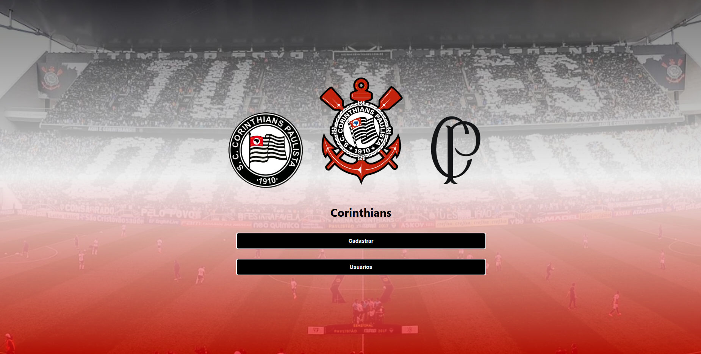
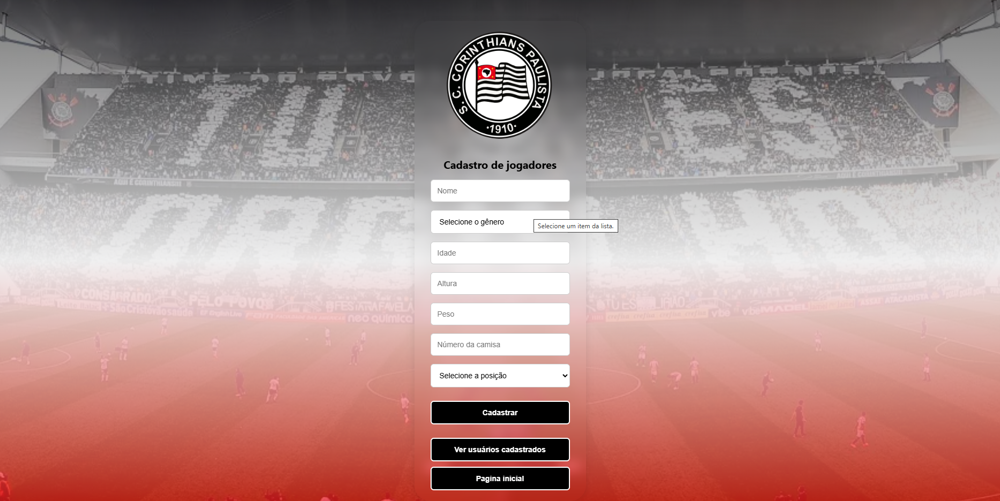
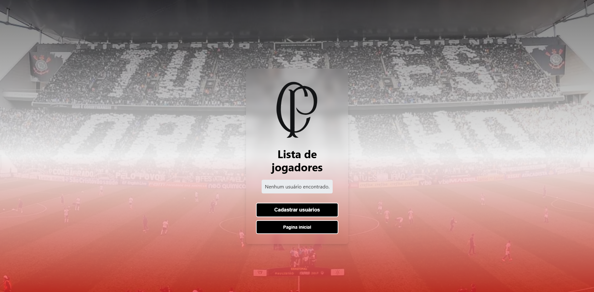
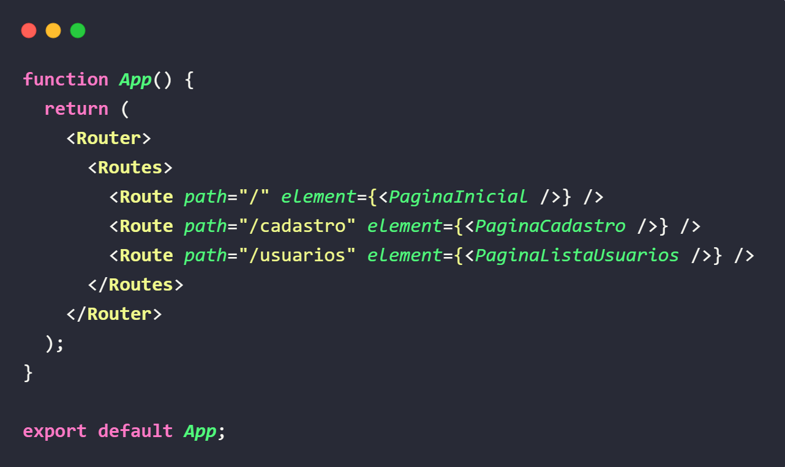

# Sistema de gestão de jogadores de futebol
Este projeto tem como objetivo gerenciar jogadores de futebol, permitindo cadastro, listagem e visualização dos detalhes dos jogadores, consumindo dados de uma API.

## Tela: Inicial

</img>

## Tela: Cadastro
</img>

## Tela: Listar Jogadores
</img>

## Sistemas de rotas
</img>

